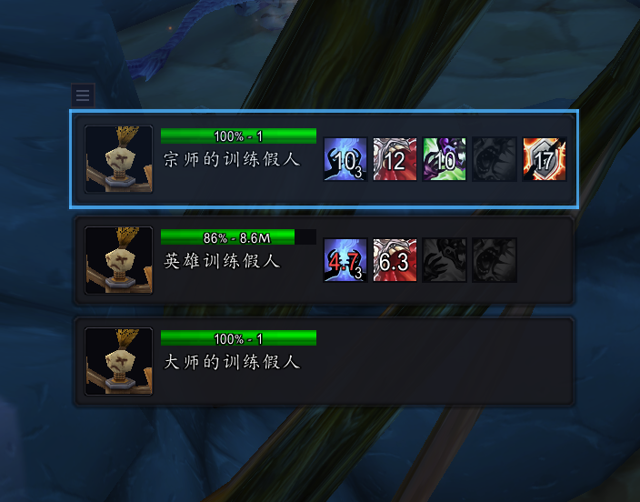

# BossTracker

多目标 Boss 追踪器 —— 魔兽世界泰坦时光服务器插件

## 截图

<!-- 将截图放在 docs/ 目录下，然后取消下面的注释 -->
<!--  -->

## 功能

- **多 Boss 血量追踪**：同时显示最多 5 个 Boss 的血量百分比和血条
- **DOT 状态监控**：实时追踪你在每个 Boss 身上的 DOT 状态（存在 / 即将过期 / 已消失）
- **点击切换目标**：点击任意 Boss 条即可切换目标，战斗中可用
- **3D 头像**：每个 Boss 条显示对应模型的 3D 头像
- **训练假人模式**：在主城等非副本环境自动检测训练假人，方便练习 DOT 循环
- **DOT 顺序自定义**：可拖拽调整 DOT 图标的显示顺序

## 支持职业

| 职业     | 专精             |
| -------- | ---------------- |
| 术士     | 痛苦、恶魔、毁灭 |
| 法师     | 火焰             |
| 牧师     | 暗影             |
| 死亡骑士 | 邪恶             |
| 德鲁伊   | 平衡、野性       |
| 萨满     | 元素             |
| 猎人     | 射击、生存       |

插件会自动检测你的职业和天赋，加载对应的 DOT 配置。

## 安装

1. 下载并解压到 `World of Warcraft/_classic_titan_/Interface/AddOns/BossTracker/`
2. 重启游戏或输入 `/reload`

## 命令

| 命令         | 说明                                 |
| ------------ | ------------------------------------ |
| `/bt`        | 显示帮助                             |
| `/bt test`   | 切换测试模式（选中目标即显示追踪框） |
| `/bt config` | 打开 DOT 顺序配置面板                |
| `/bt lock`   | 锁定 / 解锁框体位置                  |
| `/bt reset`  | 重置框体到屏幕中央                   |
| `/bt debug`  | 切换调试模式                         |
| `/bt class`  | 显示检测到的职业天赋                 |

## 使用说明

### Boss 战

进入副本后，Boss 战开始时自动显示追踪框体。每个 Boss 条从上到下包含：

- **顶栏**：3D 头像 + Boss 名字 + 血量百分比
- **血条**：极细彩色血条（绿 → 黄 → 红）
- **DOT 区**：大图标显示每个 DOT 的状态

DOT 图标状态：

- **绿色边框**：DOT 正常运行中
- **橙色边框**：DOT 即将过期（< 5 秒）
- **暗红边框 + 灰暗图标**：DOT 已消失，需要补
- **不显示**：该目标上尚未施放过此 DOT

### 训练假人

在主城等非副本环境靠近训练假人时自动进入假人模式，方便练习多目标 DOT 循环。进入已配置的副本后自动切换为 Boss 追踪模式。

### 移动框体

拖拽框体左上角的小方块即可移动位置。使用 `/bt lock` 锁定后隐藏拖拽手柄。

## 兼容性

- 客户端：泰坦时光服务器（Classic Titan）
- Interface 版本：38000
- 语言：简体中文客户端

## 作者

Qingze
